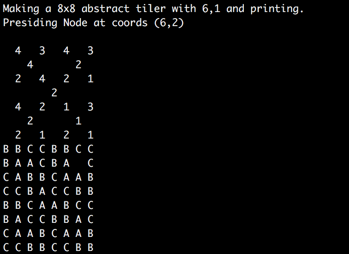

# TriominoeTiler

Given a 2^n x 2^n board with coordinates starting from (0,0)
Define Triominoes as pieces made from 3 squares that have the following configurations:
Configuration 1:  
A A  
A

Configuration 2:  
A A 
  A

Configuration 3: 
  A 
A A

Configuration 4: 
A  
A A

Goal: Given a single square/piece of the board to be removed, tile the rest of the board with triominoes.
In addition, colour the pieces such that they are identifiable from one another.

E.G.

2x2 Triominoe board with (0,0) removed. 
0 A 
A A

4x4 Triominoe board with (1,1) removed. 
A A B B 
A 0 C B 
B C C A 
B B A A

